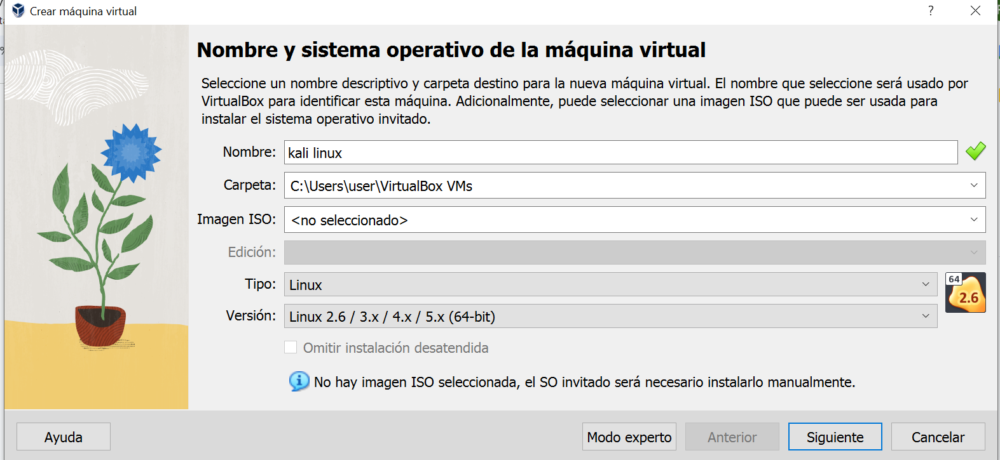
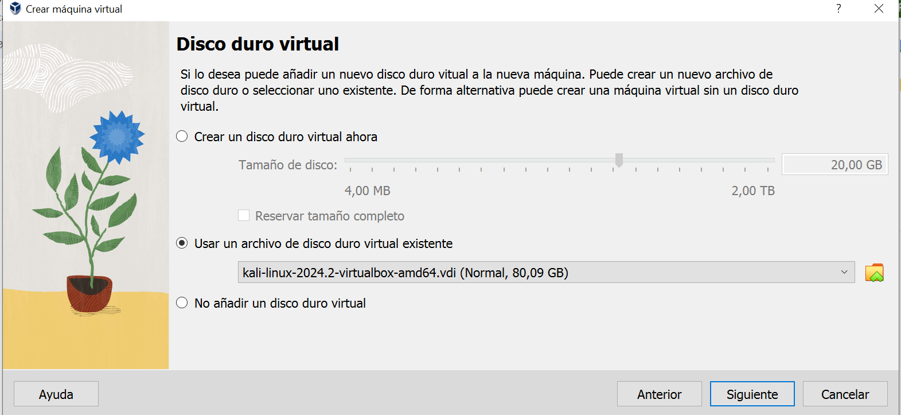

# Instalando Kali Linux en una máquina virtual


<!-- hide -->

> By [@rosinni](https://github.com/rosinni) and [other contributors](https://github.com/4GeeksAcademy/deploying-wordpress-debian/graphs/contributors) at [4Geeks Academy](https://4geeksacademy.co/)

[](https://4geeks.com)
[](https://twitter.com/4geeksacademy)

*These instructions are [available in english](https://github.com/breatheco-de/spoofing-and-DoS-lab/blob/main/README.md)*
<!-- endhide -->


<!-- hide -->


### Antes de empezar...

> ¡Te necesitamos! Estos ejercicios se crean y mantienen en colaboración con personas como tú. Si encuentras algún error o falta de ortografía, contribuye y/o repórtalo.

<!-- endhide -->

## 🌱 ¿Cómo empezar este proyecto?

Instalar Kali Linux en una máquina virtual es una excelente manera de explorar y utilizar esta poderosa herramienta de seguridad sin riesgo para tu sistema operativo principal. Este enfoque proporciona un entorno seguro y flexible que es ideal tanto para el aprendizaje como para aplicaciones profesionales. En esta práctica aprenderemos a instalar una.


### Requisitos

* Descargar VirtualBox desde  Downloads.
* Descargable desde Kali Linux Downloads.

## 📝 Instrucciones

### Paso 1: Instalación de Virtualbox
VirtualBox es una herramienta de virtualización gratuita y de código abierto que permite a los usuarios ejecutar múltiples sistemas operativos simultáneamente en su computadora.

- [ ] Ejecuta el instalador descargado y sigue las instrucciones del asistente de instalación.
- [ ] Una vez instalado, abre VirtualBox.


### Paso 2: Descarga de máquina virtual kali linux:
- [ ] Descarga desde Kali Linux Downloads. 
> NOTA: Podemos descargar una imagen ISO para instalación desde cero o una imagen preconfigurada para VirtualBox (OVA/VBOX). En esta práctica, vamos a usar la imagen VBOX.


- [ ] En la sección de imágenes para máquinas virtuales, selecciona la versión de VirtualBox y descarga el archivo VBOX (que generalmente viene como un archivo comprimido).

- [ ] Si el archivo VBOX está comprimido, descomprímelo utilizando una herramienta como 7-Zip, WinRAR o el descompresor nativo de tu sistema operativo.

### Paso 3: Creacion de la Máquina Virtual:
- [ ] Haz clic en el botón Nuevo en la ventana principal de VirtualBox.
- [ ] Asigna un nombre a la máquina virtual (por ejemplo, Kali Linux).
- [ ] Selecciona Linux como el tipo de sistema operativo y Debian (64-bit) como la versión.
- [ ] Haz clic en Siguiente.




- [ ] Selecciona la cantidad de memoria RAM que deseas asignar a la máquina virtual. Se recomienda al menos 2 GB (2048 MB), pero 4 GB (4096 MB) o más sería ideal para un mejor rendimiento.
imagen

- [ ] En la sección de disco duro, selecciona Usar un archivo de disco duro virtual existente.
- [ ] Haz clic en el icono de la carpeta al lado de esta opción y navega hasta el archivo VBOX descomprimido.
- [ ] Selecciona el archivo VBOX y haz clic en Abrir y crealo.



### Paso 4: Iniciar la Máquina Virtual
- [ ] Selecciona la máquina virtual de Kali Linux y haz clic en Iniciar. La máquina virtual se iniciará y verás la pantalla de arranque de Kali Linux.
* Utiliza las credenciales predeterminadas para iniciar sesión:
Nombre de usuario: kali
Contraseña: kali

### Paso 5: Actualización del Sistema (recomendado):
Abre una terminal y ejecuta los siguientes comandos para actualizar el sistema:

```sh
sudo apt update
sudo apt upgrade -y
```


¡Listo!
Ahora puedes comenzar a usar Kali Linux en tu máquina virtual.

