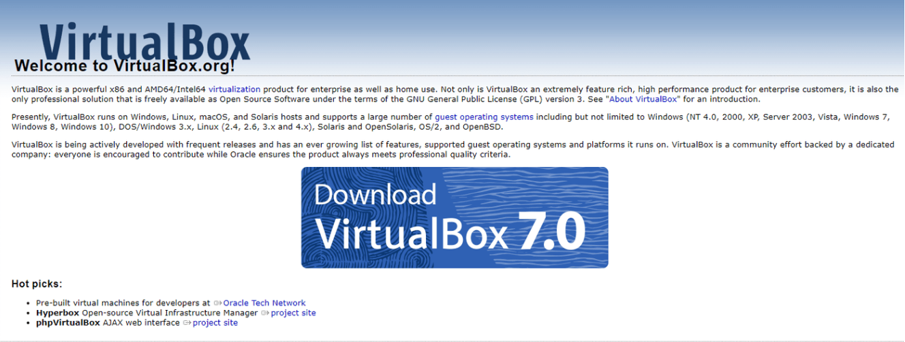

<!-- hide -->
# Installing kali linux on virtual machine

> By [@rosinni](https://github.com/rosinni) at [4Geeks Academy](https://4geeksacademy.co/)

[](https://4geeks.com)
[](https://twitter.com/4geeksacademy)

*Estas instrucciones están [disponibles en Español](https://github.com/breatheco-de/installing-kali-linux-on-virtual-machine/edit/main/README.md)*

### Before you start...

> We need you! These exercises are built and maintained in collaboration with contributors such as yourself. If you find any bugs or misspellings please contribute and/or report them.

<!-- endhide -->

## 🌱 How to start a project?

Do not clone any repository! Just follow instructions below:

Installing Kali Linux on a virtual machine is an excellent way to explore and use this powerful security tool without risking your main operating system. This approach provides a secure and flexible environment that is ideal for both learning and professional applications. In this practice, we will learn how to install one.

### Requirements
* Download VirtualBox from [Downloads](https://www.virtualbox.org/wiki/Downloads).
* Download Kali Linux from Kali Linux [Downloads](https://www.kali.org/get-kali/#kali-platforms).

## 📝 Instructions


### Step 1: Installing VirtualBox
VirtualBox is a free and open-source virtualization tool that allows users to run multiple operating systems simultaneously on their computer.

 - [ ] Run the downloaded installer and follow the installation wizard instructions.
 - [ ] Once installed, open VirtualBox.

 


### Step 2: Downloading Kali Linux Virtual Machine
 * Download from Kali Linux [Downloads](https://www.kali.org/get-kali/#kali-platforms).

> 💡 NOTE: You can download an ISO image for a fresh installation or a pre-configured image for VirtualBox (OVA/VBOX). In this practice, we'll use the VBOX image.


- [ ] In the virtual machines section, select the VirtualBox version and download the VBOX file (typically comes as a compressed file).


- [ ] If the VBOX file is compressed, unzip it using a tool like 7-Zip, WinRAR, or your OS's built-in decompressor.

### Step 3: Creating the Virtual Machine

 - [ ] Go to the folder where you extracted the Kali Linux download and double-click the `vbox` file. This will start your Kali machine with all configurations ready: machine name, operating system type, CPU, etc.

> 💡 IMPORTANT: If you are doing this with an OVA file, you should:

* Go to the File option in VirtualBox -> `Import Appliance...`
* In the window that opens, click on `Choose virtual appliance file...` and select the OVA file of Kali Linux you downloaded.
* In the next window, you can review and adjust the virtual machine settings (e.g., memory allocation, number of CPUs, etc.). At least 2 GB (2048 MB) is recommended, but 4 GB (4096 MB) or more would be ideal for better performance.


* Once you are satisfied with the settings, click Import/Finish.

### Step 4: Starting the Virtual Machine

- [ ] Select the Kali Linux virtual machine and click "Start." The VM will boot up, and you'll see the Kali Linux boot screen.
- [ ] Use the default credentials to log in:
     Username: kali
     Password: kali

### Step 5: System Update (Recommended)
Open a terminal and run the following commands to update the system:

```sh
sudo apt update
sudo apt upgrade -y
```

All Set!
Now you can start using Kali Linux on your virtual machine.
